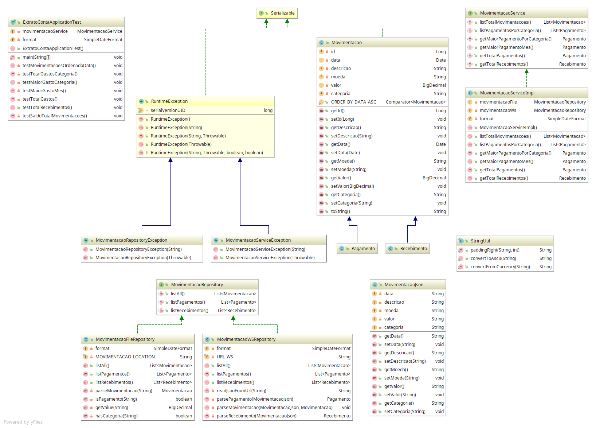

# Sistema de Log Extrato Bancário

### REQUISITOS E INSTRUCOES PARA EXECUTAR O PROJETO

* E necessário ter o Java 8 instalado(build path esta para o java 8);


# Instruções


### PARA TESTAR

* No pront de commando;

```sh

Navegar até a pasta do projeto.

cd /extrato-conta/extrato_conta_app;
java -jar extrato-conta.jar


```


### DOCUMENTACOES


#### Class Diagram



 
#### Javadoc

[Acesse clicando aqui](docs/javadoc/index.html)


### ARQUITETURA UTILIZADA NO DESENVOLVIMENTO 

* Foi feito um projeto web utilizando camada de camada de teste (test service) , servico(negocio) e camada DAO/Repository(Com implementacao File e Rest Ws);

* Camada Repository - Responsável por buscar e normalizar os dados de fontes externas

     Analisando o arquivo de log e o rest service assumi que movimentacoes com valores negativos sao pagamentos e com valores positivos sao recebimentos.

* Camada Service - Responsavel pelos calculos e validacao de regras de negocio de acordo com os requisitos;

* Camada Test - Responsavel por testar todos os metodos da camada service e DAO e apresenta-los em forma de log.

* Como teve restrição de frameworks não foi utilizado nenhum framework de testes ou injecao de dependencia(como junit,mockito,maven,spring, etc.).

### Libs Utilizadas
	gson-2.8.5.jar


### PARTTERNS UTILIZADOS 
    * Strategy
    * SingleTon
    * Service-to-work(Business Delegate)
    * DAO